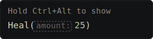
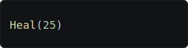
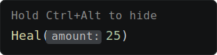
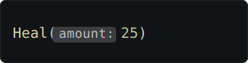

## Inline type hints

VS Code enables **inlay hints** by default. For WitcherScript, these show parameter names in fucntion calls

**Off unless pressed** is recommended: it avoids adding clutter, but allows quick peeking: hold `Ctrl` + `Alt` to reveal the hints on demand.

<checklist>
	

		<checkbox when-checked="command:witcherscript.inlayHints.offUnlessPressed" checked-on="witcherscript.inlayHintsMode == 'offUnlessPressed'">
			
			Off unless pressed
		</checkbox>
		<checkbox when-checked="command:witcherscript.inlayHints.off" checked-on="witcherscript.inlayHintsMode == 'off'">
			
			Off
		</checkbox>
	

	

		<checkbox when-checked="command:witcherscript.inlayHints.onUnlessPressed" checked-on="witcherscript.inlayHintsMode == 'onUnlessPressed'">
			
			On unless pressed
		</checkbox>
		<checkbox when-checked="command:witcherscript.inlayHints.on" checked-on="witcherscript.inlayHintsMode == 'on'">
			
			On
		</checkbox>
	

</checklist>
