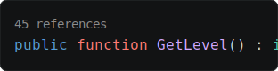
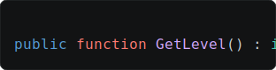

## Reference-count code lens

Show a code lens above declarations (classes, structs, functions, etc) with a count of how many times it's referenced across your project. Click the count to list the references.

It's off by default. Pick a tile below, or change it any time from the **Code Lens > References** setting.

<checklist>
	

		<checkbox when-checked="command:witcherscript.enableReferencesCodeLens" checked-on="config.witcherscript.codeLens.references">
			
			Code Lens
		</checkbox>
		<checkbox when-checked="command:witcherscript.disableReferencesCodeLens" checked-on="config.witcherscript.codeLens.references == false">
			
			Disabled
		</checkbox>
	

</checklist>
